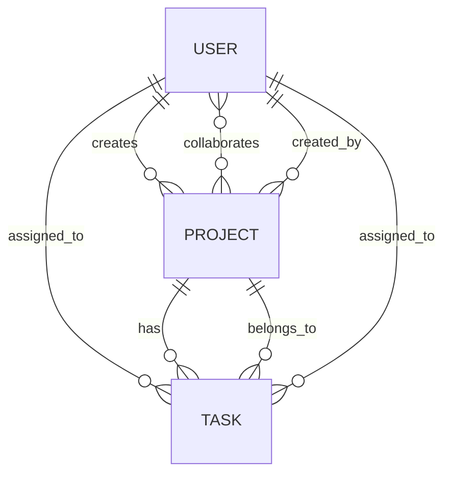

# 🧠 Task Collaboration API

An ASP.NET Core API that allows users to create projects, assign tasks, and collaborate with other users.

---

## 📌 Why This Project?

This project is part of my learning roadmap before diving into **security** and **authentication/authorization** in ASP.NET.

I've already built:
- A **Management API** – foundational CRUD experience
- A **Blog API** – practiced many-to-one relationships

Now I'm building this **Task Collaboration API** to:
- Handle **complex relationships** (one-to-many, many-to-one, and many-to-many)
- Get ready for **real-world user-based access** scenarios
- Prepare for adding **authentication & role-based security**

---

## 🧱 Entity Relationship Diagram

---

## 📊 Entity Tables

### 👤 User Table

| Column       | Type     | Description                             |
|--------------|----------|-----------------------------------------|
| Id           | int (PK) | Primary key                             |
| FirstName    | string   | User's first name                       |
| LastName     | string   | User's last name                        |
| Email        | string   | User's email address (unique)           |
| Password     | string   | Hashed password                         |
| CreatedDate  | DateTime | When the user was created               |

**Relationships:**
- One-to-many → Projects (created by the user)
- One-to-many → Tasks (assigned to the user)
- Many-to-many → Projects (collaborating)

---

### 📁 Project Table

| Column       | Type     | Description                             |
|--------------|----------|-----------------------------------------|
| Id           | int (PK) | Primary key                             |
| Name         | string   | Project name                            |
| Description  | string   | Brief project description               |
| CreatedDate  | DateTime | When the project was created            |
| UserId       | int (FK) | Creator of the project (User.Id)        |

**Relationships:**
- Many-to-one → User (creator)
- One-to-many → Tasks
- Many-to-many → Collaborators (Users)

---

### ✅ Task Table

| Column         | Type     | Description                            |
|----------------|----------|----------------------------------------|
| Id             | int (PK) | Primary key                            |
| Title          | string   | Task title                             |
| Content        | string   | Task content/details                   |
| CreatedDate    | DateTime | When the task was created              |
| ProjectId      | int (FK) | Project this task belongs to           |
| AssignedUserId | int (FK) | User assigned to this task             |

**Relationships:**
- Many-to-one → Project
- Many-to-one → User (assigned)

---

## 🚀 Planned Features
- Create & manage projects
- Assign tasks to users
- Invite users to collaborate on projects
- View tasks per project
- Filter tasks by assigned user

---

## 🧪 Next Steps
- Add **unit tests** and **integration tests** using xUnit
- Implement **authentication and role-based security** in the next phase

---

## 🛠 Tech Stack
- ASP.NET Core Web API
- Entity Framework Core
- SQL Server
- Postman (for manual testing)
- xUnit (for automated testing, coming soon)

---

## ✍️ Author
**Alexander Agu**
